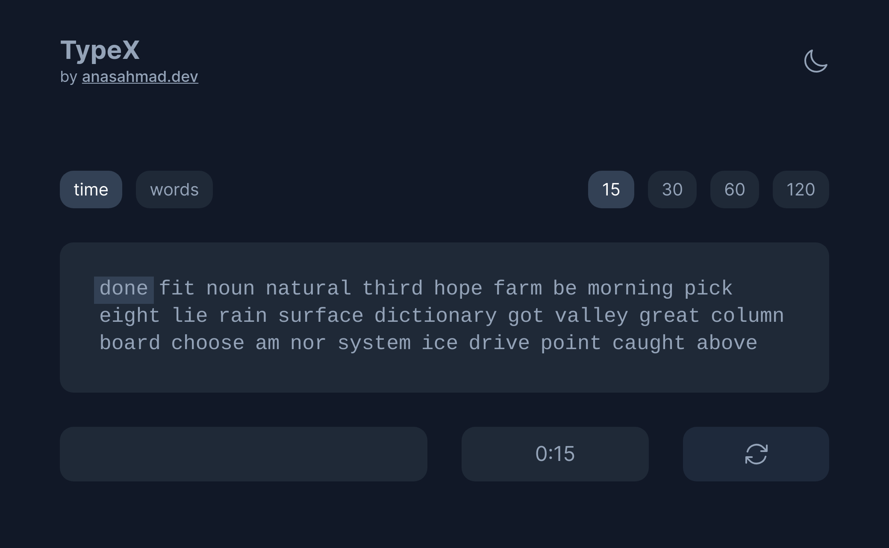
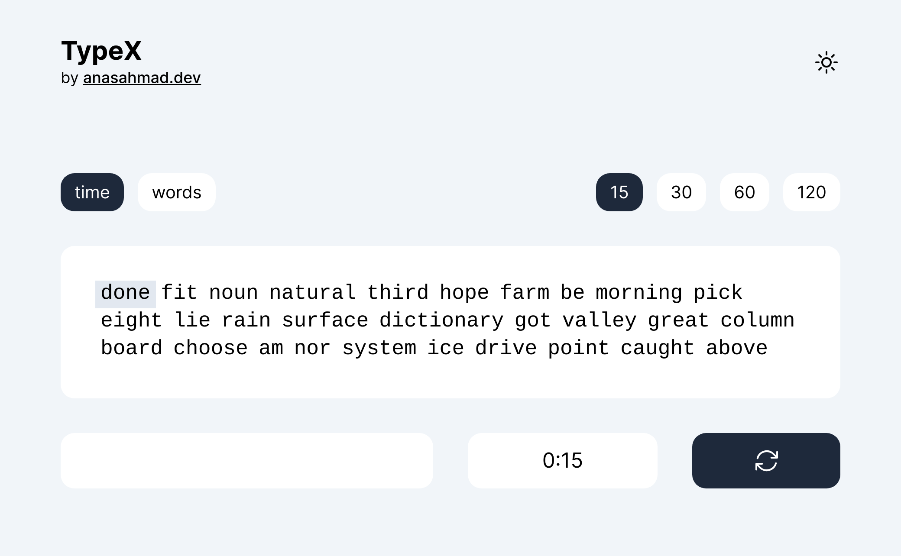

# TypeX: Minimal Typing Test

[Live Version](https://typex.anasahmad.dev/)

## Key Features

- Simple and minimal
- Time Mode and Words Mode
- Dark/Light Theme
- Responsive Design
- Saves your preference in local storage

## Tech Stack

- React
- TailwindCSS
- TypeScript

## Screenshots

Dark Mode:



Light Mode:



## Run Locally

Clone the project

```bash
  git clone https://github.com/anasahmd/typex.git
```

Go to the project directory

```bash
  cd typex
```

Install dependencies

```bash
  npm install
```

Start the dev server

```bash
  npm run dev
```

## License

This software is licensed under the [MIT](https://choosealicense.com/licenses/mit/)

## 🔗 Links

[](https://anasahmad.dev/)
[](https://www.linkedin.com/in/anasahmd/)
